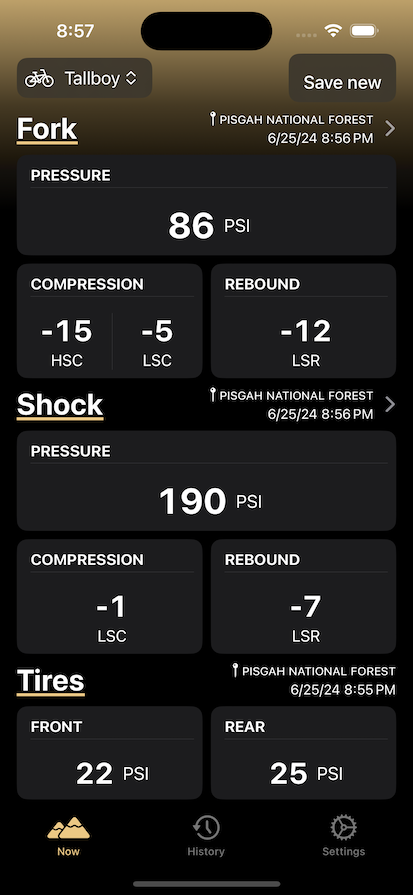
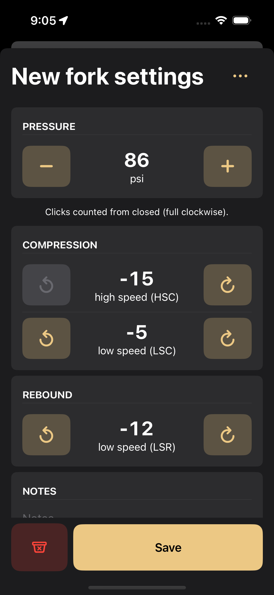
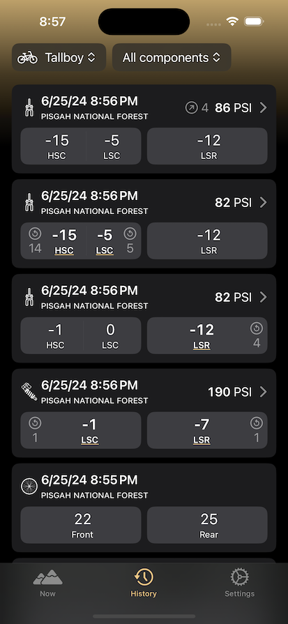

Struggling with where to store the settings for the suspension components on your mountain bike? Tired of taking your gloves off mid-ride to type into a note on your phone with sweaty hands and a tiny keyboard on your screen? Want to be able to track your changes with location, notes, and more? Damper is the thing for you.

Damper allows you to add all of your bikes and their individual components, and track the current settings of them individually. Each saved setting adds to a growing history list that shows you what changed (example: added 3 clicks of compression) and where it happened at. Best of all, all of the controls are big enough that you can change values with your gloves on.

Features:
- Any bike, any component.
- Full suspension and hardtail support.
- Track high-speed compression, low-speed compression, high-speed rebound, low-speed rebound, air pressure, and coil weight.
- Optionally add a location to a group of saved settings.
- Favorite a group of settings to easily find it again.
- Add notes that remind you of extra details from a run.
- Easily share the settings of a component with a shop or mechanic in photo form.

# Screenshots

# Support
Need help? Email hi -at- damper dot bike with info and I'll try to sort you out the best I can.